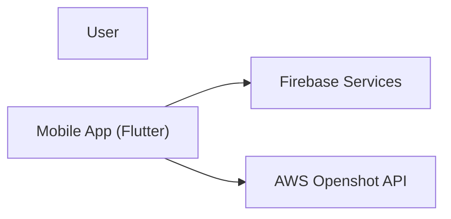
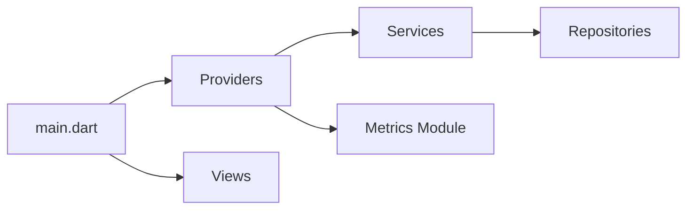

# Project Structure and Architecture

## Overview
We are building a TikTok clone MVP with an AI-first approach for Android using Flutter and Firebase, integrating with AWS Openshot API for video processing. This document outlines our project structure and architecture, refactored to support a future comprehensive metrics recording system, reduced integration complexity, and enhanced system design practices based on the C4 model with Mermaid diagram support.

## Directory Structure
```
/ (root)
├── assets/               # Static resources (images, icons, fonts)
├── android/              # Android-specific configuration (e.g., google-services.json)
├── docs/                 # Design documents and system diagrams (C4 model using Mermaid)
│   ├── SYSTEM_DESIGN.md  # Detailed system design including C4 diagrams
│   └── README.md         # Overview for design documentation
├── lib/
│   ├── main.dart         # App entry point
│   ├── src/
│   │   ├── models/       # Data models (e.g., Video, User)
│   │   ├── providers/    # State management using Provider
│   │   ├── repositories/ # Data access layer for external services
│   │   │   └── user_repository.dart  # Handles user data operations in Firestore
│   │   ├── services/     # External integrations and business logic
│   │   │   ├── firebase_service.dart      # Firebase integration for Auth, Firestore, Storage
│   │   │   ├── aws_openshot_service.dart    # Handles AWS Openshot API calls
│   │   │   └── video_processing_facade.dart # Facade to centralize external service integration
│   │   ├── views/        # UI screens and pages
│   │   ├── widgets/      # Reusable UI components
│   │   ├── utils/        # Utility classes, constants, and helper functions
│   │   │   └── exceptions.dart # Custom exceptions and error handling
│   │   └── metrics/      # Metrics recording module for analytics and event logging
│   │         ├── metrics_service.dart    # Logs events (uploads, errors, performance metrics)
│   │         ├── metrics_model.dart      # Defines structure for metrics events
│   │         └── analytics_config.dart   # Configuration for third-party analytics tools
│   └── README.md             # Project overview and instructions
```

## Architecture

### C4 Model Alignment
Our architecture aligns with the C4 model, which helps us create multiple layers of diagrams:
- **System Context Diagram:** A high-level view of external interactions.
- **Container Diagram:** An overview of the high-level technology and responsibilities.
- **Component Diagram:** A detailed view inside key containers.
- **Code Diagram:** (On-demand) Lower-level design best generated by IDE tooling.

### Layered Separation

1. **UI Layer**
   - Contains views/screens and widgets that interact with the user.

2. **Business Logic Layer**
   - Managed by Providers in the `/providers/` directory, orchestrating data flow and user interactions.

3. **Service Layer**
   - Handles external integrations and core business logic. It includes:
     - **Firebase Service:** Manages authentication, video uploads to Firebase Storage, and metadata updates in Firestore.
     - **AWS Openshot Service:** Handles communication with the AWS Openshot API for video processing.
     - **VideoProcessingFacade:** Provides a unified interface that wraps interactions with external services, centralizing error handling and logging (including metrics events).

4. **Repository Layer**
   - Abstracts data access operations from the rest of the application.
   - Provides a clean API for data operations (create, read, update, delete).
   - Handles data persistence and retrieval from Firestore.
   - Makes it easier to modify the underlying data source without affecting the rest of the app.

5. **Metrics Module**
   - Dedicated to recording comprehensive metrics for analytics and performance monitoring using an event-driven approach.

### System Diagrams (Mermaid)

#### System Context Diagram


#### Container Diagram


#### Component Diagram (Example for Mobile App)


### Video Upload to Publishing Pipeline

1. The user selects a video via the UI.
2. A Provider initiates the process by calling the VideoProcessingFacade.
3. The Firebase Service uploads the video to Firebase Storage.
4. The AWS Openshot Service processes the video.
5. The Metrics Service logs significant events (e.g., upload start, finish, errors) throughout the process.
6. Upon completion, the Provider updates Firestore to publish the video.

### Reducing Integration Complexity

- **Repository Pattern:** Abstracts data access operations, making it easier to modify data sources.
- **Facade Pattern:** Centralizes external service calls to reduce integration complexity.
- **Metrics Module:** Decouples analytics from core business logic, supporting easy future upgrades.
- **Event-Driven Architecture:** Enables decoupled logging of significant events, facilitating maintenance and scalability.

## Future Considerations

- As the app scales, consider transitioning from Provider to more robust state management solutions (e.g., Bloc or Riverpod).
- Continuously update the C4 model diagrams in `docs/SYSTEM_DESIGN.md` to reflect changes and support team understanding.
- Monitor and adjust Firebase and AWS integrations based on user load and performance metrics.
- Enhance the Metrics module with additional analytics tools as requirements evolve. 