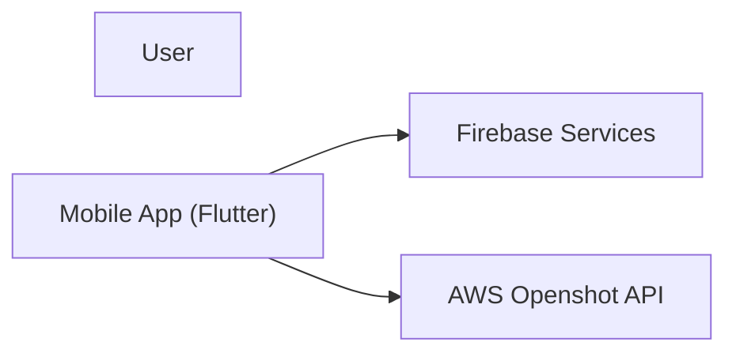
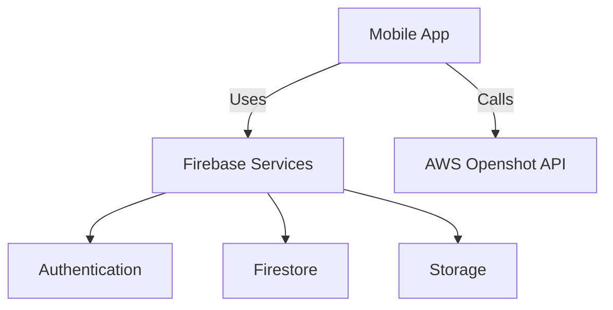
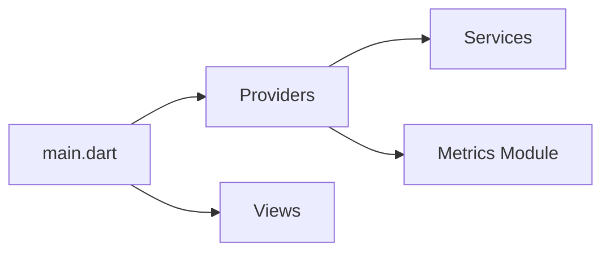

# System Design

## Overview
This document outlines our detailed system design based on the C4 Model. It provides diagrams using Mermaid to visualize the layered architecture and component interactions within our TikTok clone MVP.

## C4 Model Diagrams

### System Context Diagram

### Container Diagram

### Component Diagram (Example for Mobile App)

## Future Considerations

- Enhance the Metrics module with additional analytics and monitoring tools.
- Further decompose complex modules as new features are integrated.
- Update diagrams regularly as the system evolves. 